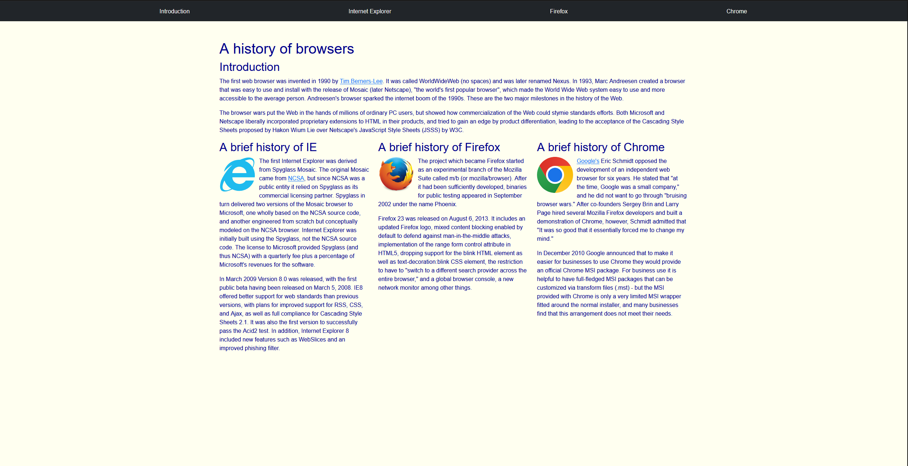

# UI Frameworks: Simplifying Web Design

## Prior Experience
Before this course, I had no experience with web design at all, besides some courses I completed with freeCodeCamp. I had never used a UI framework before, so that was an interesting change in style that I was not used to. I've always wanted to learn how to build websites that make people want to visit them, so I was glad for the opportunity to learn different ways of making a website.

## Explaining UI Frameworks
User interfaces have been a staple of the modern web since the start of the internet. No longer did you have to be tech-savvy in order to go online. These days, people may take them for granted, but looking back a couple of decades, you can see a massive difference in how people use computers. UIs are the screens, websites, and other visual elements that make it easier for individuals to interact with a service or product. Most UIs are developed with HyperText Markup Language (HTML) and Cascading Style Sheets (CSS), meaning if you want to create one, you must know how to use them. This is where UI frameworks come in.

UI frameworks are a set of classes and interfaces that predefine elements and certain behaviors for a window-based UI subsystem. They are similar to how in C or Python, you call a library that has predefined functions that you can use, instead of having to write them yourself. In ICS 314, we are using Bootstrap 5 as our UI framework of choice, which has a lot of templates and other elements of a UI page that we can just call from their predefined list.

## Experiences with Bootstrap
My experience with Bootstrap has been fairly positive. I really like how I am able to create professional websites without much effort, just by copying their basic layout using Bootstrap for things like Navbars, Footers, and icons for social media and such. I also appreciate how it cuts down on the amount of code you have to write, allowing me to focus more on design rather than implementation.

## Web Page Examples using Bootstrap
Below are some of the websites I've recreated (just the main home screen) using Bootstrap:

  

    <h3 style="padding: 15px; margin: 0; background-color: #f8f9fa; text-align: center; font-size: 1.2em;">Example Site 1</h3>
    
  

  

    <h3 style="padding: 15px; margin: 0; background-color: #f8f9fa; text-align: center; font-size: 1.2em;">Example Site 2</h3>
    
  

  

    <h3 style="padding: 15px; margin: 0; background-color: #f8f9fa; text-align: center; font-size: 1.2em;">Example Site 3</h3>
    
  

