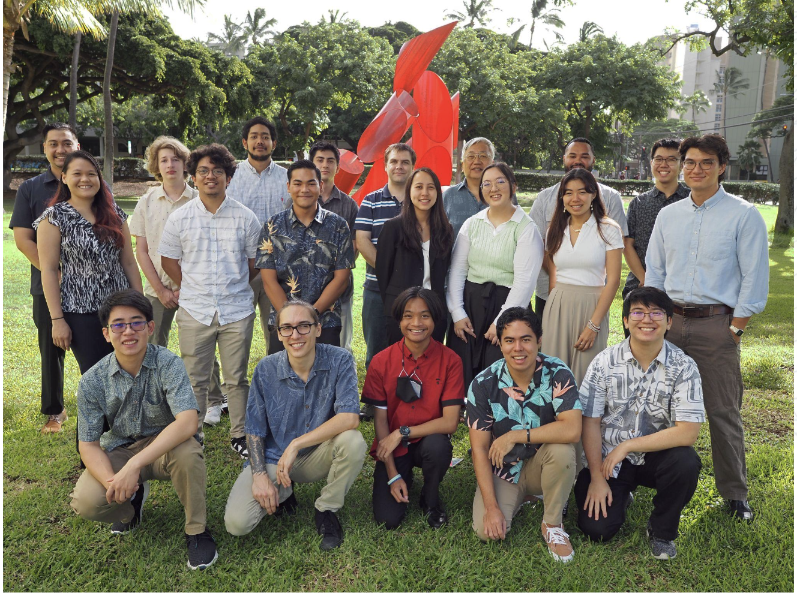

  

## Overview

The Smart Campus Energy Lab (SCEL) is a Vertically Integrated Project (VIP) at the University of Hawaii at Manoa. SCEL addresses one of Hawaii's most critical challenges: achieving 100% renewable energy by 2045. The project's primary objective is to collect and analyze weather data to predict patterns and identify optimal locations for future renewable energy installations.

## Team Structure

SCEL operates with a multidisciplinary approach, comprising several specialized teams:

1. Hardware Teams:
   - Team Apple
   - Team Guava

2. Software Teams:
   - Firmware Team: Responsible for maintaining software on local servers and weather boxes
   - Machine Learning Team: Utilizes collected data to predict weather patterns

## Personal Experience: Firmware Team (Fall 2022)

### Key Responsibilities and Achievements

1. Infrastructure Maintenance:
   - Repaired and optimized the test server
   - Fine-tuned the server for efficient data collection from weather boxes
   - Maintained and improved database and gateway servers

2. Cross-Team Collaboration:
   - Provided troubleshooting support for hardware teams (Apple and Guava)
   - Assisted with firmware version issues and connection problems

3. Data Pipeline Optimization:
   - Simplified and restructured the data pipeline
   - Utilized SQL, command-line operations, and C programming to refine weatherbox schemas

### Skill Development

1. Technical Skills:
   - SQL database management
   - XBEE configuration for data transmission
   - C programming
   - Server maintenance and optimization

2. Soft Skills:
   - Effective teamwork and communication
   - Time management in a fast-paced environment
   - Problem-solving and troubleshooting

## Project Impact

SCEL plays a crucial role in Hawaii's renewable energy initiative. By collecting and analyzing weather data, the project contributes to the strategic placement of future renewable energy sources, supporting the state's goal of 100% renewable energy by 2045.

## Conclusion

Participation in SCEL offers a unique opportunity for students to gain hands-on experience in renewable energy technology while developing essential technical and interpersonal skills. The project exemplifies the importance of interdisciplinary collaboration in addressing complex environmental challenges.
